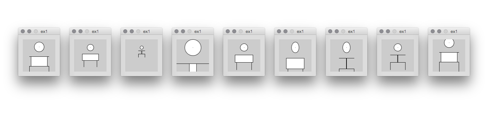
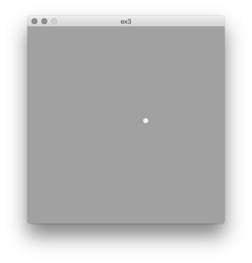
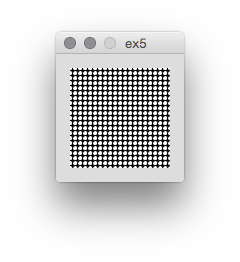
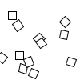

Programming With Processing
===========================

Examples written for University of Applied Sciences Potsdam (Germany) FHP  
[Input/Output](https://interface.fh-potsdam.de/eingabe-ausgabe/) Basics of Process-Oriented Design by Fabian Morón Zirfas  

###[ex0](https://raw.githubusercontent.com/fabiantheblind/Programming-With-Processing/master/ex0/ex0.pde) Basic build in variables like width and height  

__assignment:__  

- Do calculations based on canvas width and height. 
- Output to console.  

###[ex1](https://raw.githubusercontent.com/fabiantheblind/Programming-With-Processing/master/ex1/ex1.pde) Basics primitive formes.

__assignment:__  

- Draw a human.  

  

###[ex2](https://raw.githubusercontent.com/fabiantheblind/Programming-With-Processing/master/ex2/ex2.pde) Colors in RGB  

__assignment:__  
- make a compelling color compelling color composition.
- use HSB

  

###[ex3](https://raw.githubusercontent.com/fabiantheblind/Programming-With-Processing/master/ex3/ex3.pde) mouse interaction   

__assignment:__  
- write a programm that changes parameters based on the mouse position.

###[ex4](https://raw.githubusercontent.com/fabiantheblind/Programming-With-Processing/master/ex4/ex4.pde) conditional and save images  

__assignment:__  

- write a programm that changes a color or shape on a keypress.  

   

###[ex5](https://raw.githubusercontent.com/fabiantheblind/Programming-With-Processing/master/ex5/ex5.pde) using loops

__assignment:__  

- fill the canvas with primitive forms by using a loop.  

###[ex6](https://raw.githubusercontent.com/fabiantheblind/Programming-With-Processing/master/ex6/ex6.pde) Particle System (Advanced)  

__assignment:__  
- download or clone the repo  
- change the display of all particles at once

  

------------

##License

Copyright (c)  2014 Fabian "fabiantheblind" Morón Zirfas  
Permission is hereby granted, free of charge, to any person obtaining a copy of this software and associated documentation files (the "Software"), to deal in the Software  without restriction, including without limitation the rights to use, copy, modify, merge, publish, distribute, sublicense, and/or sell copies of the Software, and to  permit persons to whom the Software is furnished to do so, subject to the following conditions:  
The above copyright notice and this permission notice shall be included in all copies or substantial portions of the Software.  
THE SOFTWARE IS PROVIDED "AS IS", WITHOUT WARRANTY OF ANY KIND, EXPRESS OR IMPLIED, INCLUDING BUT NOT LIMITED TO THE WARRANTIES OF MERCHANTABILITY, FITNESS FOR A  PARTICULAR PURPOSE AND NONINFRINGEMENT. IN NO EVENT SHALL THE AUTHORS OR COPYRIGHT HOLDERS BE LIABLE FOR ANY CLAIM, DAMAGES OR OTHER LIABILITY, WHETHER IN AN ACTION OF  CONTRACT, TORT OR OTHERWISE, ARISING FROM, OUT OF OR IN CONNECTION WITH THE SOFTWARE OR THE USE OR OTHER DEALINGS IN THE SOFTWARE.  

see also http://www.opensource.org/licenses/mit-license.php

